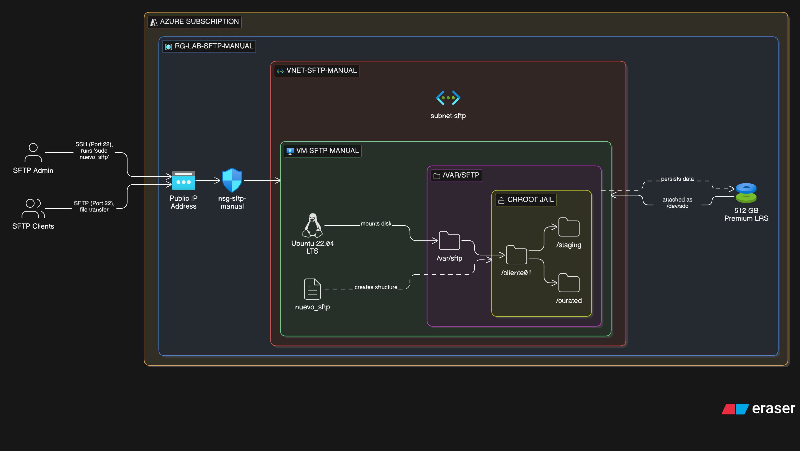

# ☁️ Azure SFTP Server (IaaS) - Cost Optimized

Este repositorio contiene las herramientas necesarias para desplegar y administrar un servidor **SFTP seguro y económico** en Azure utilizando una Máquina Virtual (Ubuntu).

A diferencia de la solución nativa "SFTP on Blob Storage" (PaaS), esta arquitectura basada en VM (IaaS) permite reducir costos operativos significativamente (hasta un 70% menos) para escenarios de uso estándar, ofreciendo control total sobre el sistema operativo y el manejo de archivos.

## 📂 Contenido del Repositorio

| Archivo | Ubicación | Descripción |
| :--- | :--- | :--- |
| `az-cli-create-resources.sh` | **Local** | Script de Azure CLI para crear/destruir la infraestructura (VM, Red, Disco de 512GB). |
| `nuevo_sftp` | **Servidor** | Script interactivo para crear usuarios SFTP, generar contraseñas y configurar permisos (Chroot) automáticamente. |

## 🚀 Arquitectura

* **Computación:** Azure VM (Ubuntu 22.04) - Tamaño `Standard_B1s` (ajustable).
* **Almacenamiento:** Disco de datos administrado de **512 GB** (montado en `/var/sftp`).
* **Seguridad:** * NSG restringido al puerto 22 (SSH).
    * **Chroot Jail:** Los usuarios están aislados en su propia carpeta y no pueden navegar por el sistema.
    * **No Shell:** Los usuarios SFTP no tienen acceso a la terminal (`/bin/false`).

---

## 🛠️ Guía de Despliegue (Paso a Paso)

### Paso 1: Desplegar Infraestructura (Desde tu PC)
Ejecuta el script local para crear la red, la máquina virtual y conectar el disco.

1.  Asegúrate de tener [Azure CLI](https://docs.microsoft.com/cli/azure/install-azure-cli) instalado y logueado (`az login`).
2.  Dale permisos de ejecución y corre el script:

```bash
chmod +x az-cli-create-resources.sh
./az-cli-create-resources.sh

```

3. Selecciona la **Opción 1**. El script verificará si los recursos existen y, si no, los creará.
4. Al finalizar, **copia la IP Pública y la contraseña de administrador** que se muestran en pantalla.

### Paso 2: Configuración Inicial del Servidor (Por única vez)

Como es un entorno de aprendizaje manual, el disco de 512GB viene "crudo" y el servicio SSH necesita configuración.

1. Conéctate por SSH:
```bash
ssh sftpadmin@<TU_IP_PUBLICA>

```


2. **Formatear y Montar el Disco de Datos:**
```bash
# Identificar el disco (usualmente /dev/sdc)
lsblk

# Formatear en ext4
sudo mkfs.ext4 /dev/sdc

# Crear punto de montaje
sudo mkdir -p /var/sftp

# Montar
sudo mount /dev/sdc /var/sftp

# Hacerlo persistente al reinicio
echo "/dev/sdc /var/sftp ext4 defaults 0 0" | sudo tee -a /etc/fstab

```


3. **Configurar SSH para SFTP (Chroot Jail):**
Edita el archivo de configuración:
```bash
sudo nano /etc/ssh/sshd_config

```


Ve al final del archivo y agrega el siguiente bloque:
```text
Match Group sftp_users
    ChrootDirectory /var/sftp/%u
    ForceCommand internal-sftp
    PasswordAuthentication yes
    X11Forwarding no
    AllowTcpForwarding no

```


Guarda (`Ctrl+O`) y sal (`Ctrl+X`), luego reinicia el servicio:
```bash
sudo systemctl restart ssh

```


4. **Instalar el script `nuevo_sftp`:**
Crea el archivo para el script de gestión de usuarios:
```bash
sudo nano /usr/local/bin/nuevo_sftp

```


*Copia y pega el contenido del archivo `nuevo_sftp` de este repositorio.*
Hazlo ejecutable:
```bash
sudo chmod +x /usr/local/bin/nuevo_sftp

```


---

## 👤 Gestión de Usuarios

Una vez configurado el servidor, agregar nuevos clientes es trivial gracias al script helper.

### Crear un nuevo usuario

Desde dentro del servidor (SSH), ejecuta:

```bash
sudo nuevo_sftp

```

El asistente interactivo te pedirá:

1. **Nombre de usuario** (ej: `cliente01`).
2. **Contraseña** (puedes dar ENTER para generar una segura automáticamente).

El script se encargará de crear las carpetas, asignar los permisos `root` necesarios para el Chroot y generar un resumen listo para enviar por correo.

### Estructura de Carpetas Resultante

Cada usuario verá únicamente su propia carpeta con la siguiente estructura:

```text
/ (Raíz del usuario - Solo Lectura)
├── staging/  (Carpeta de Subida - Escritura permitida)
└── curated/  (Carpeta de Descarga/Procesados - Escritura permitida)

```

---


> **Tip:** Puedes apagar la VM (`Stop/Deallocate`) cuando no esté en uso para reducir el costo de cómputo a casi cero (solo pagarás el disco).

## ⚠️ Notas de Seguridad

* El script `az-cli-create-resources.sh` abre el puerto 22 a **todo internet** (`*`). Para producción, edita la regla del NSG para permitir solo tu IP o la VPN de tu empresa.
* Recuerda mantener el servidor Ubuntu actualizado ejecutando `sudo apt update && sudo apt upgrade` periódicamente.

---

**Autor:** [chichocoria]
